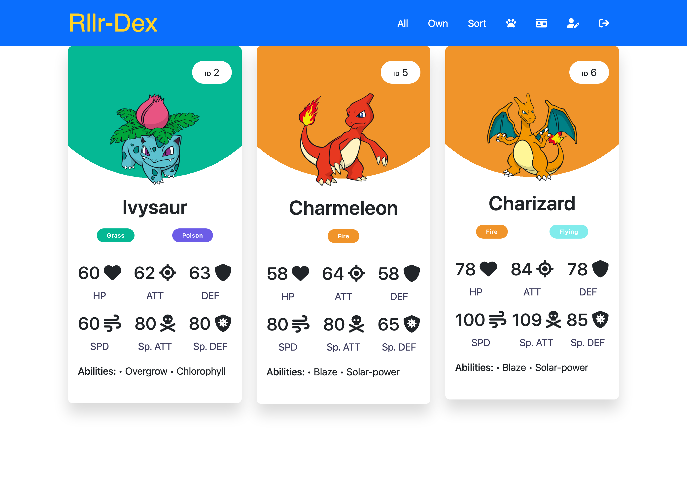

# Project-2---RllrDex
 [](https://opensource.org/licenses/MIT)
Developers: [Cecilia](https://github.com/responsibleparty), [Hai](https://github.com/caubenondo), [Marshall](https://github.com/marshall-rust), [Patrick](https://github.com/monacoglynn), [Richmond](https://github.com/richmonddz)


##[Live Demo](https://project2-rllr.herokuapp.com/)
  ## Table of Contents
  * [Description](#Description)
  * [Concept](#Concept)
  * [User Story](#UserStory)
  * [Technology](#Tech)
  * [Installation](#Installation)
  * [API](#API)
  * [Future Developement](#Future)
# Description<a name='Description'></a>

Project Description: Ever wondered what would happen when Pokemon and social media evolve into one? Well  Rōrādekki is your answer! Post, update and collect Pokemon and compare them with your friends! Keep an eye out for those legendaries…. 👀

## Concept <a name='Concept'></a>
RllrDex is an application where users can interact and talk about all things Pokemon! Users can customize their own PokeTea

## User Story <a name='UserStory'></a>
As a Pokemon trainer, I want to meet like minded trainers to discuss new pokemons. RllrDex is perfect for me!


##Technologies & Packages Used <a name='Tech'></a>
- bcrypt
- connect-session-sequelize
- dotenv
- express
- express-handlebars
- express-session
- mysql2
- sequelize
- nodemon
- pokedex-promise-v2

## Installation <a name='Installation'></a>
 To install necessary dependencies, run the following command:
  ###### Install npm packages
  ```
    npm i
  ```
  
  ###### Create database in mySQL
 ```
    mysql -u <username> -p
 ```
 ```
    source ./db/schema.sql
 ```
 ###### Connect mySQL database with .env file
  ```
    DB_USER=''
    DB_PW=''
    DB_NAME='pokemon_db'
  ```
 ###### Seed database with default data
```
npm run seed
```
###### Start server
```
npm run start
```
###### Watch server for development
```
npm run watch
```
You need to install `nodemon` before running
## Public API routes <a name='API'></a>
#### User
- POST `/api/users/` to sign up
- POST `/api/users/login` to login
- POST `/api/users/logout` to close session and logout  
- GET `/api/users/{:username}` will return infomation of specific username
- GET `/api/users/` will return 
    - username 
    - user's id  
    - user's followers (self Many-to-Many Association with USER model)
    - following usernames that user follows (self Many-to-Many Association with USER model)
    - collection of Pokemon card that user own (Many-to-Many Association with POKEDEX model)
#### Posts (one-to-many relation with USER model)
- POST `/api/posts/` will create post via req.body
- DELETE `/api/posts/{:id}` will check authorization of logged in user and destroy specific `id` post that belong to logged in user
- UPDATE `api/posts/{:id}` will allow user update user's specific `id` post via req.body
- GET `api/posts/{:id}` will return specific post of that `id` 
#### Comments (one-to-many relation with USER model)
- POST `/api/comments/` will create comment via req.body
- DELETE `/api/comments/{:id}` will check authorization of logged in user and destroy specific `id` comment that belong to logged in user
#### Pokemons (Many-to-many relation with USER)
- GET `/api/pokemons/{:query}` will return a pokemon info that match either `id` or `name` of pokemon in the query
- GET `/api/pokemons/` will return ALL pokemons
- POST `/api/pokemons/game/play` with `withAuth` will handle the lootbox (randomizer) mechanic on server side for anti-cheating purpose
    - It will search for logged in user's collection of card, which is a array of pokemon `id`s
    - then It will generate a random pokemon id that doesn't in user's collection
    - then it pull create a row entry of loggedin userid and pokeid to `Ownership` model (which is association table for USER table and POKEDEX table)
    - then will response with status 200 for front end fetch feedback   
- GET `api/game/own` will return the Ownership table
#### Network (Associtation table handle following and followed of USER table)
- POST `/api/network/` with `withAuth` will create a folllow-and-followed relation between users
- GET `api/network/` will return the Follow table, which show user relations 

## Future Development <a name='Future'></a>
- Add trading features
- Enhanced UI
- Battle online
- Instant message with friends 



